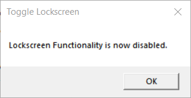
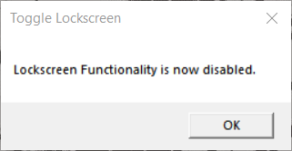

# ToggleLock.ps1
A script that toggles the lock functionality in windows. This is used to temporary disable Win+L for better VM usage.

# Purpose
I use a VM with many machines on windows. I am very shortcut-heavy on VMs. On windows, you cannot rebind Win+L (Lockscreen) easily. This script allows me to toggle the lockscreen functionality whenever i need to work on my VM and toggle back when i need to lock my computer.

# Usage
Download the files, make sure make sure the batch file and the script is in the same folder. Just run the batch file every time you want to execute the script. It is recommended to make a shortcut on the desktop for easy access. Optionally, you can change the shortcut icon for aestheics.

# Demo
After launching the script, a prompt should tell you that the lockscreen functionality is disabled.

After launching the script again, a prompt should tell you that the lockscreen functionality is re-enabled.

# Important
It is important to note that the script assumes that you have exisiting registry in the path 'HKCU:\Software\Microsoft\Windows\CurrentVersion\Policies\System' called 'DisableLockWorkStation'.
